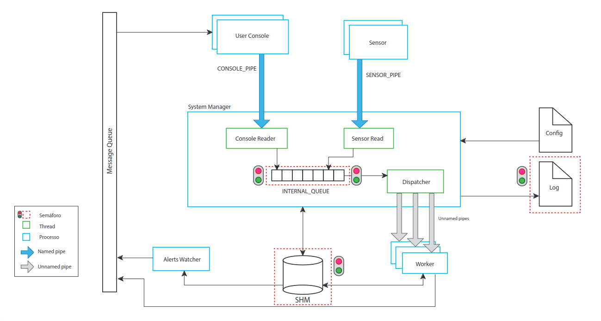
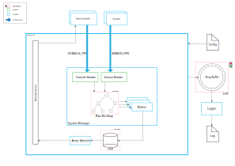

# Revamped IoT System Simulator
This project is based on an Operating System's class assignment but better thought out, better structured and more efficient.

## Original Diagram
[](assets/original-diagram.png)

## Revamped Diagram
[](assets/new_diagram.svg)

## Build
### Release Build
Default compilation option, the program will run as normal.

*Using build script*
```shell
./build.sh Release
```
*Manually*
```sh
mkdir build
cd build
cmake -DDCMAKE_BUILD_TYPE=Release ..
make
```

### Debug Build
When setting the debug build type, CMake will define the DEBUG macro and the simulator will give all kinds of information about what's going on under the hood (ie. insertions in the Bin Max Heap). 

*Using build script*
```shell
./build.sh Debug
```

*Manually*
```sh
mkdir build
cd build
cmake -DCMAKE_BUILD_TYPE=Debug ..
make
```

## Usage
### iot-system-sim
Only a single iot-system-sim instance should be running

```sh
./iot-system-sim *config_file*
```
### sensor
Multiple sensors can be created

```sh
./sensor *sensorID* *interval (seconds)* *key* *min value* *max value* *config file*
```