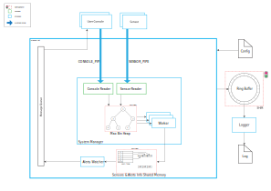

# Revamped IoT System Simulator
This project is based on an Operating System's class assignment but better thought out, better structured and more efficient.

## Original Diagram


## Revamped Diagram


## Build
```sh
mkdir build
cd build
cmake ..
make
```

## Usage
### iot-system-sim
```sh
./iot-system-sim *config_file*
```
### sensor
```sh
./sensor *sensorID* *interval (seconds)* *key* *min value* *max value* *config file*
```